# Application Flows

**Product:** Real-Time Leaderboard System
**Related:** [DESIGN.md](DESIGN.md) · [SCHEMA.md](SCHEMA.md) · [SECURITY.md](SECURITY.md)

All external flows pass through the API Gateway. `lb://` denotes Eureka-based load-balanced resolution. Mermaid diagrams illustrate the target architecture (Phase 0 — not yet implemented; see [TRACKER.md](TRACKER.md)).

---

## Flow 1 — Registration

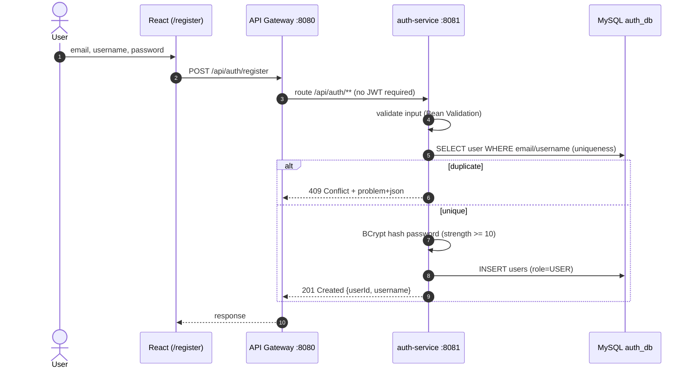

Failure paths: validation error → 400; unexpected → 500 with correlation ID.

---

## Flow 2 — Login

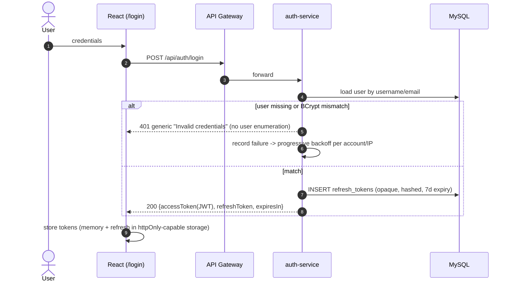

---

## Flow 3 — JWT Authentication (every protected request)

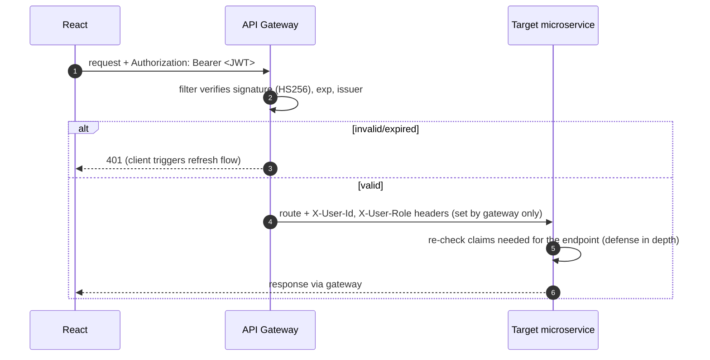

Notes: services never accept identity headers from outside the gateway (network-level trust boundary); stateless — no session store.

---

## Flow 4 — Score Submission (core write path)

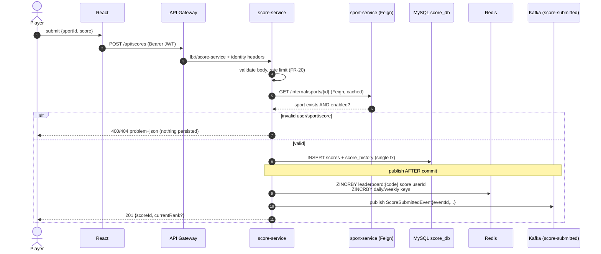

Design decisions:
- User validity comes from gateway-verified JWT claims (`X-User-Id`), so no user-service call is needed on this hot path.
- Redis update happens synchronously here for immediate read-your-write on boards; Kafka remains the source that drives *broadcast* and any reconciliation.
- If Redis or Kafka are briefly down, MySQL commit still succeeds and a reconciliation job replays history ([DESIGN.md §Failure scenarios](DESIGN.md)).

---

## Flow 5 — Redis Leaderboard Update

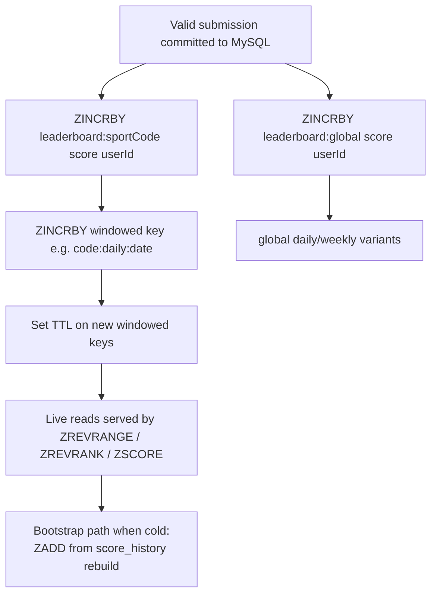

Command rationale lives in [SCHEMA.md §Redis commands](SCHEMA.md). `{sportCode}` always comes from the sports table — never hardcoded.

---

## Flow 6 — Kafka Event Flow

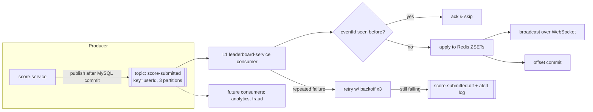

Event payload, versioning, and idempotency rules: [SCHEMA.md §Kafka](SCHEMA.md) / [DESIGN.md §Kafka](DESIGN.md).

---

## Flow 7 — Real-Time WebSocket Update

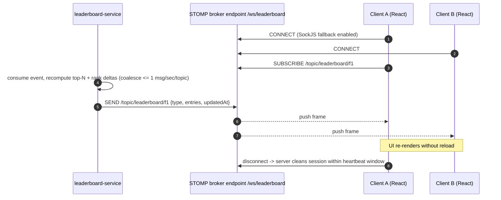

Client lifecycle: auto-reconnect with exponential backoff 1 s→30 s; on reconnect fetch REST snapshot first, then resubscribe. Fallback polling every 15 s if socket unavailable.

---

## Flow 8 — Global Leaderboard (read)

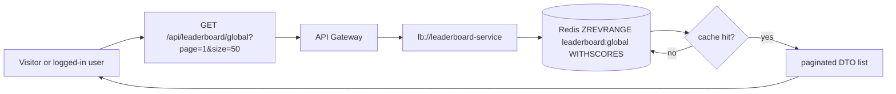

Pagination uses ZSET range windows (`start/stop` offsets). Ties share rank per PRD §14.

---

## Flow 9 — Sport Leaderboard

Same as Flow 8 but `/api/leaderboard/{sportCode}`; service resolves the sport code against the sports catalog (cached Feign call), then reads `leaderboard:{sportCode}`. Unknown/disabled sport → 404/400. Because the code is data, a future `TENNIS` row instantly yields `leaderboard:tennis` reads with no code change.

Daily/weekly variants append `:daily:{date}` / `:weekly:{yyyy}-W{ww}` segments resolved from query params (defaults: today/current ISO week, UTC).

---

## Flow 10 — User Rank ("Where do I stand?")

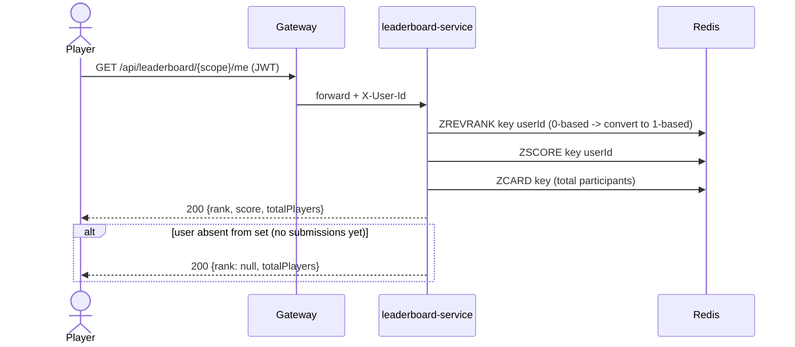

---

## Flow 11 — Score History

`GET /api/scores/me?page=&size=` → score-service → MySQL `score_history` (index: `(user_id, created_at DESC)`), paginated newest-first. Includes sport name resolved from cached catalog. Immutable records — corrections are new rows, never updates (auditability).

---

## Flow 12 — Top Players Report

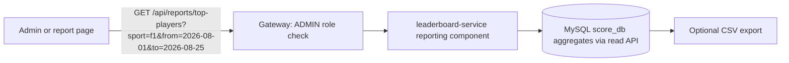

Reports intentionally read **MySQL**, not Redis: they answer historical windows whose Redis keys may have expired. Numbers must reconcile with SQL aggregates (PRD RPT-4).

---

## Flow 13 — Admin Flow (sport management)

```mermaid
sequenceDiagram
    actor AD as Admin
    participant R as React /admin
    participant GW as Gateway
    participant SP as sport-service

    AD->>R: create sport TENNIS
    R->>GW: POST /api/sports (Bearer ADMIN JWT)
    GW->>SP: route (gateway + service both check role claim)
    SP->>SP: validate unique code
    SP->>SP: INSERT sports row (active=true)
    SP-->>AD: 201 {id, code:"TENNIS", ...}
    Note over SP,RD: catalog caches evicted;<br/>leaderboard:tennis keys/topics derive lazily
```

Disable flow: PATCH `/api/sports/{id}/status` → subsequent submissions rejected 400; historical data and boards remain intact.

---

## Flow 14 — Error Flow (uniform)

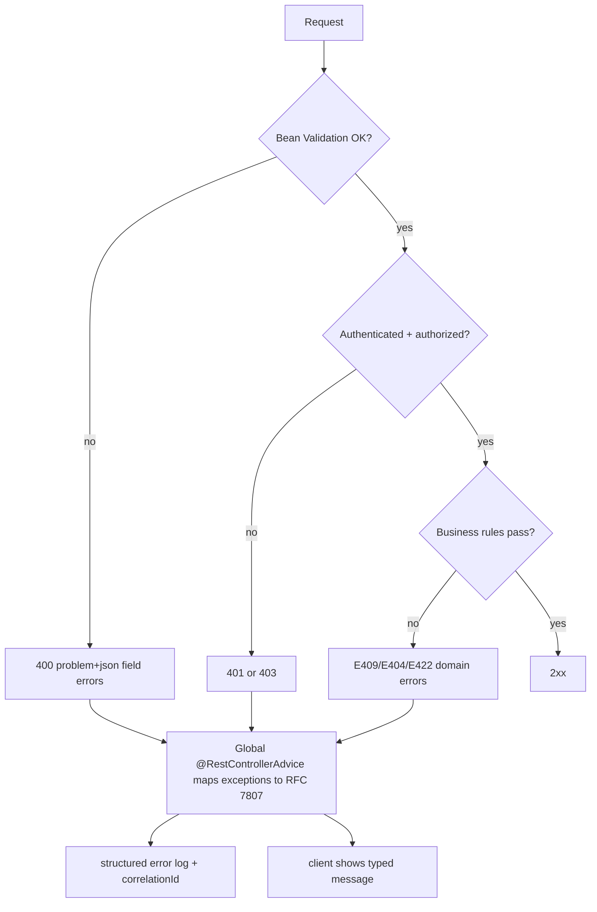

Every 5xx carries a `correlationId`; the client surfaces it for support. Contract details in [DESIGN.md §Error handling](DESIGN.md).

---

## Flow 15 — Logout / Token Refresh

```mermaid
sequenceDiagram
    autonumber
    participant R as React
    participant GW as Gateway
    participant A as auth-service
    participant DB as MySQL

    Note over R: access token expired (or 401 received)
    R->>GW: POST /api/auth/refresh {refreshToken}
    GW->>A: forward
    A->>DB: lookup hashed refresh token
    alt valid & unrevoked & unexpired
        A->>DB: revoke old token, INSERT rotated token (reuse detected => revoke family)
        A-->>R: 200 {new accessToken, new refreshToken}
    else invalid/reused
        A-->>R: 401 -> redirect to /login
    end

    Note over R: explicit logout
    R->>GW: POST /api/auth/logout {refreshToken}
    GW->>A: forward
    A->>DB: mark refresh token revoked
    A-->>R: 204 ; client clears local tokens, closes WebSocket
```
