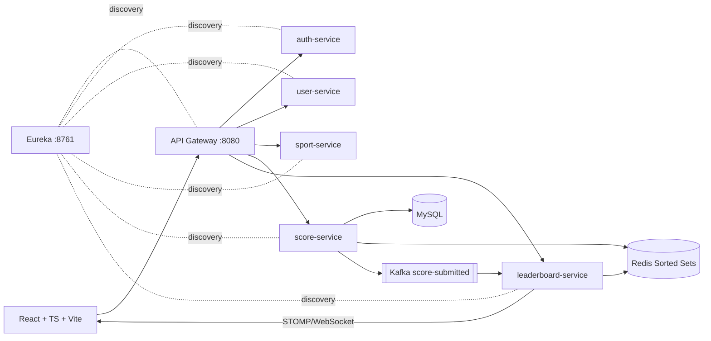

# Real-Time Leaderboard System

A production-style, multi-sport, real-time leaderboard platform. Authenticated users submit scores for configurable sports and watch rankings update live — no page refreshes.

> Reference project: **https://roadmap.sh/projects/realtime-leaderboard**
>
> Status: Phase 0 docs ✅ · Phase 1A microservice foundations ✅ · Phase 2 authentication ✅ · **Phase 3 sport service implemented, tested (55/55) and verified live through the gateway against MySQL**. Redis, Kafka, WebSocket, scoring and UI are NOT implemented yet. No live demo exists; this section will be updated only when a real deployment exists.

---

## Project Overview

The system decouples the write path (score ingestion → durable MySQL storage) from the read/broadcast path (Kafka events → Redis Sorted Set ranking → WebSocket push). Sports are data, not code: Football, Cricket, and Formula 1 ship as seed rows, and adding a new sport requires zero architectural change.

## Features

- JWT authentication with refresh-token rotation and USER/ADMIN roles
- Configurable sports catalog with admin enable/disable
- Validated score submission with rate limiting
- Global, per-sport, daily, weekly, and F1 season leaderboards
- Personal rank/score lookup
- Real-time WebSocket updates to connected clients
- Score history and period-based reports
- OpenAPI/Swagger documentation per service

## Supported Sports

| Sport | Code | Notes |
|---|---|---|
| Football | `FOOTBALL` | V1 |
| Cricket | `CRICKET` | V1 |
| Formula 1 | `F1` | season-scoped board |

Sports live in MySQL ([SCHEMA.md](SCHEMA.md)) — new sports are inserted rows, not redesigns.

## Architecture



Full diagrams: [DESIGN.md](DESIGN.md). Flows: [APPFLOW.md](APPFLOW.md).

## Technology Stack

- **Backend:** Java 17 (LTS), Spring Boot 3.3.13, Spring Cloud 2023.0.5 (Eureka, Gateway; OpenFeign planned), Spring Security + JWT (planned), Spring Data JPA/Hibernate (planned), Maven Wrapper 3.3.2
- **Data:** MySQL 8, Redis 7 (Sorted Sets), Apache Kafka 3.x
- **Real-time:** Spring WebSocket + STOMP (+ SockJS fallback)
- **Frontend:** React 18, TypeScript (strict), Vite
- **DevOps:** Docker, Docker Compose, Git/GitHub
- **Quality:** JUnit 5, Mockito, Spring Boot Test; springdoc-openapi (Swagger)

Rationale for every choice: [TECHSPECS.md](TECHSPECS.md).

## Microservices

| Service | Port | Responsibility | Docs schema |
|---|---|---|---|
| service-registry | 8761 | Eureka discovery | — |
| api-gateway | 8080 | single entry point: routing, CORS, JWT filter | DESIGN §4 |
| auth-service | 8081 | registration, login, JWT + refresh tokens, roles | SCHEMA §3.1–3.2 |
| user-service | 8082 | profiles, user info/statistics | SCHEMA §3.3 |
| sport-service | 8083 | sports CRUD, competitions, enable/disable, seeds | SCHEMA §3.4 (implemented) |
| score-service | 8084 | submission validation, persistence, event publishing | SCHEMA §3.5–3.6 |
| leaderboard-service | 8085 | boards, rank queries, Kafka consumer, WebSocket push, reports | SCHEMA §4 |

## Sport Service

Implemented in Phase 3 (port 8083, registers with Eureka as `SPORT-SERVICE`, database `leaderboard_sport`).

**Supported sports:** exactly three — **Football** (`FOOTBALL`), **Cricket** (`CRICKET`), **Formula 1** (`F1`). The three sports are seeded automatically at startup if missing (idempotent `CommandLineRunner`; restarts never duplicate or delete data). Unsupported codes (BASKETBALL, TENNIS, …) are rejected with HTTP 400 — never silently created.

**Sport endpoints**

| Method | Path | Access |
|---|---|---|
| GET | `/api/sports` · `/api/sports/{id}` · `/api/sports/code/{code}` | public |
| POST / PUT / PATCH status / DELETE | `/api/sports` · `/api/sports/{id}` | ADMIN |

**Competition endpoints** (each competition belongs to exactly one sport)

| Method | Path | Access |
|---|---|---|
| GET | `/api/competitions` · `/api/competitions/{id}` · `/api/sports/{sportId}/competitions` | public |
| POST | `/api/sports/{sportId}/competitions` | ADMIN |
| PUT / PATCH status / DELETE | `/api/competitions/{id}` | ADMIN |

Deleting a sport that still owns competitions is refused with `409 CONFLICT` — deactivate it instead.

```bash
curl http://localhost:8080/api/sports
curl http://localhost:8080/api/sports/code/F1
curl -X POST http://localhost:8080/api/sports/1/competitions -H "Authorization: Bearer $ADMIN_TOKEN" -H "Content-Type: application/json" -d '{"name":"Premier League","code":"PREMIER_LEAGUE","startDate":"2026-08-15","endDate":"2027-05-24"}'
```

## Database

MySQL schemas are owned per service. The auth schema **`leaderboard_auth`** (tables `users`, `refresh_tokens`) is live as of Phase 2 and the sport schema **`leaderboard_sport`** (tables `sports`, `competitions`) is live as of Phase 3 — both via Hibernate `ddl-auto=update`; Flyway/Liquibase migrations are required before production. Other schemas arrive with their phases — full column-level specs and ER diagrams: [SCHEMA.md](SCHEMA.md). MySQL is the durable source of truth; it never serves live ranking.

## Redis Leaderboard

Redis Sorted Sets power all current standings:

```
leaderboard:global            leaderboard:{code}
leaderboard:{code}:daily:{yyyy-MM-dd}
leaderboard:{code}:weekly:{yyyy}-W{ww}
leaderboard:f1:season:{yyyy}
```

Command rationale (`ZINCRBY`, `ZADD`, `ZREVRANGE`, `ZREVRANK`, `ZSCORE`, `ZCARD`, …) and TTL policy: [SCHEMA.md §4](SCHEMA.md).

## Kafka

Topic `score-submitted` (key = userId, idempotent consumer on `eventId`, DLT on poison pills). Event contract and evolution rules: [SCHEMA.md §5](SCHEMA.md), failure semantics: [DESIGN.md §8](DESIGN.md).

## WebSocket

STOMP endpoint `/ws/leaderboard`; subscriptions `/topic/leaderboard/global` and `/topic/leaderboard/{sportCode}`; coalesced ≤ 1 msg/sec/topic; client reconnects snapshot-first. Details: [DESIGN.md §9](DESIGN.md).

## Authentication

Implemented in auth-service (Phase 2):

- **Registration** `POST /api/auth/register` — validates username/email/password, stores BCrypt hash in MySQL (`leaderboard_auth.users`). Always creates a USER account; requested roles are ignored so nobody can self-elevate to ADMIN.
- **Login** `POST /api/auth/login` — returns `{accessToken, refreshToken, tokenType: "Bearer", expiresIn, userId, username, role}`.
- **JWT access tokens** — HS256, secret from `JWT_SECRET` env var, default 15-minute TTL.
- **Refresh tokens** — opaque 512-bit random value; only its SHA-256 hash is stored; 7-day TTL.
- **Refresh** `POST /api/auth/refresh` — exchanges a valid refresh token for a new access token.
- **Logout** `POST /api/auth/logout` *(requires Bearer token)* — revokes the refresh token server-side. Access tokens remain cryptographically valid until they expire (stateless JWT), which is why their lifetime is short.
- **Who am I** `GET /api/auth/me` *(requires Bearer token)* — safe identity payload for the current user.

```bash
curl -X POST http://localhost:8080/api/auth/register -H "Content-Type: application/json" \
  -d '{"username":"john","email":"john@example.com","password":"Passw0rd123"}'

curl -X POST http://localhost:8080/api/auth/login -H "Content-Type: application/json" \
  -d '{"username":"john","password":"Passw0rd123"}'
```

Roles: `USER`, `ADMIN`; `/api/auth/admin/**` is ADMIN-only. Full security design: [SECURITY.md](SECURITY.md); schema: [SCHEMA.md](SCHEMA.md).

## Frontend

React + TypeScript strict + Vite SPA talking exclusively to the API Gateway: login/register, dashboard, global + sport leaderboards (live), score submission, history, reports, admin panel. Layout: [DESIGN.md §10](DESIGN.md).

## Project Structure

```
real-time-leaderboard/
├── backend/
│   ├── service-registry/
│   ├── api-gateway/
│   ├── auth-service/
│   ├── user-service/
│   ├── sport-service/
│   ├── score-service/
│   └── leaderboard-service/
├── frontend/
├── docker/
├── docs/            # architecture / api / database notes
├── .github/         # workflows + PR template
├── PRD.md           TECHSPECS.md     APPFLOW.md     DESIGN.md
├── SCHEMA.md        IMPLEMENTATIONPLAN.md   TRACKER.md
├── RULES.md         SECURITY.md
└── README.md   .env.example   .gitignore
```

## API Documentation

Each backend service exposes Swagger UI via springdoc-openapi (reached through the gateway once services exist): `http://localhost:8080/api/<service>/swagger-ui.html`. Endpoint catalog notes will accumulate under [docs/api/](docs/api/).

## Environment Variables

Copy `.env.example` → `.env` and fill real values locally. Never commit `.env`. The full variable table lives in [SECURITY.md §3](SECURITY.md).

## Local Development

### Build and run a backend service (Maven Wrapper — no global Maven required)

```bash
cd backend/auth-service        # or any service under backend/
.\mvnw.cmd clean test          # compile + run tests (verified for all 7 services)
.\mvnw.cmd spring-boot:run     # start the service
```

- Start `service-registry` first; its dashboard is at http://localhost:8761.
- Verified baseline (Phase 1A): all seven services pass `.\mvnw.cmd clean test`; api-gateway registers with the registry through Eureka discovery (`lb://` routes are wired, downstream services arrive in later phases).
- The first wrapper invocation downloads Maven 3.9.9 plus dependencies into `~/.m2` — one-time internet access required.

### Full stack via Docker Compose (target state — Phase 14, not yet available)

```bash
cp .env.example .env          # then edit values
docker compose -f docker/docker-compose.yml up --build
# frontend: http://localhost:5173 · gateway: http://localhost:8080 · eureka: http://localhost:8761
```

## Docker

Target state: `docker compose up --build` boots MySQL, Redis, Kafka, all seven backend services, and the frontend container with healthcheck-gated startup ordering. Tracked in [TRACKER.md Phase 14](TRACKER.md).

## Testing

JUnit 5 + Mockito unit tests and Spring Boot Test integration tests per service; frontend component tests land with Phase 11; coverage gate ≥ 70% enforced from Phase 13.

## Git Workflow

Monorepo with permanent `main` and `develop` branches; all work happens on `feature/*` branches merged into `develop` via PRs (Conventional Commits); releases flow through `release/*` to `main`. Rules: [RULES.md](RULES.md).

## Screenshots

*Placeholder — screenshots will be added when the UI exists.*

## Demo

*Placeholder — no live deployment yet. A real URL will appear here after Phase 15; none is claimed now.*

## Roadmap.sh Project

This repository implements the roadmap.sh challenge:
**https://roadmap.sh/projects/realtime-leaderboard**

## Future Improvements

See [PRD.md §17](PRD.md): scoring-policy engine, achievements/streaks, private leagues, OAuth social login, fraud-detection consumers, Kubernetes deployment, mobile clients.

## License

To be decided before public release (candidate: MIT).
