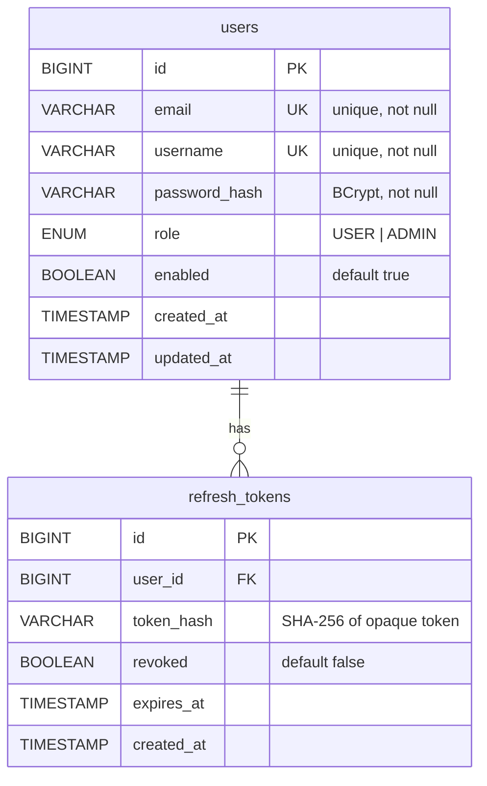
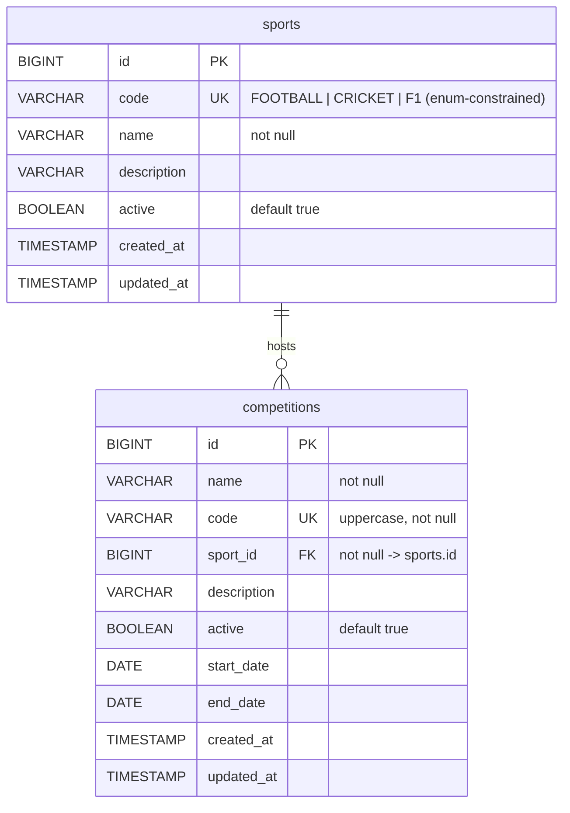
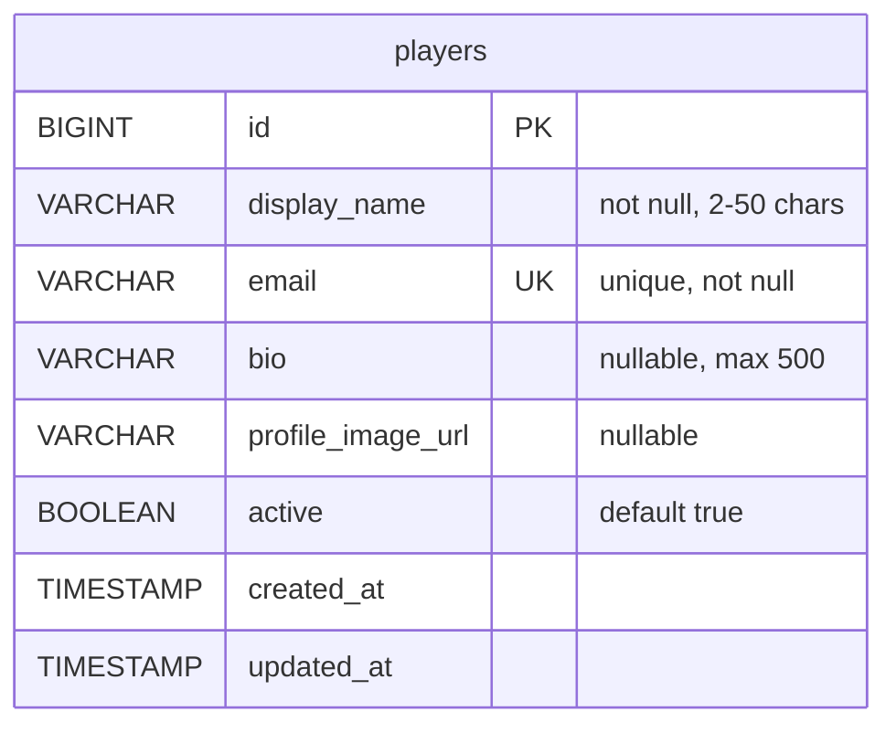
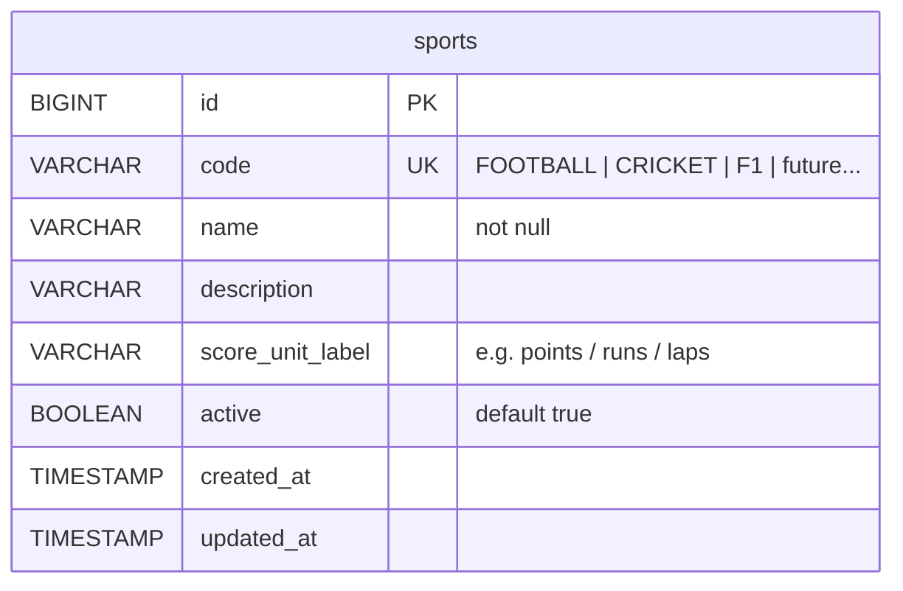
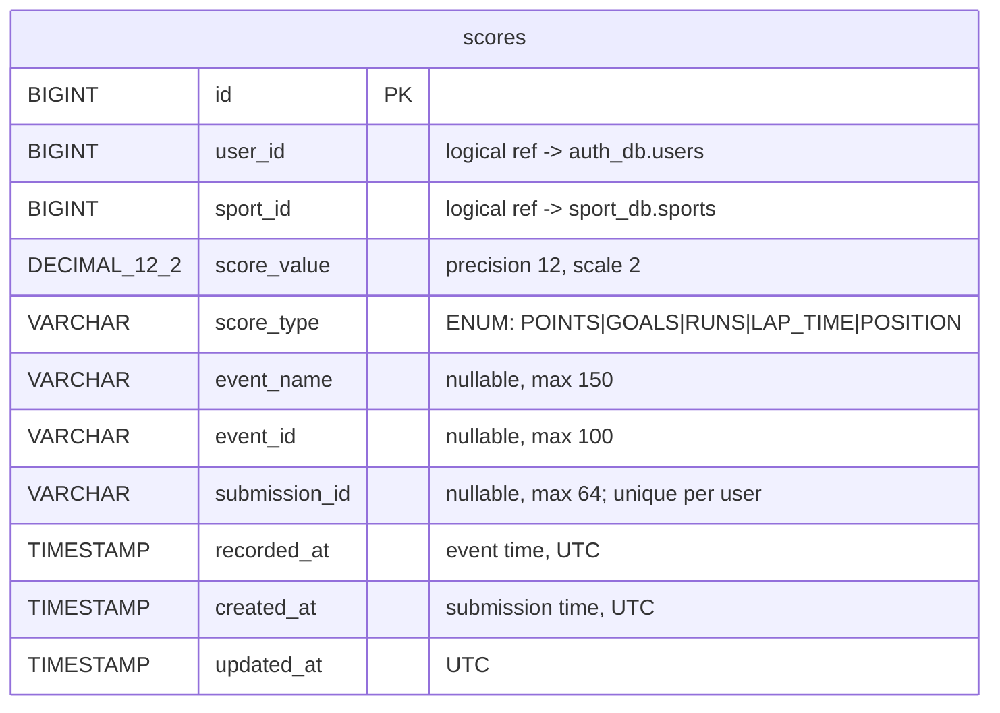

# Database & Redis Schema

**Product:** Real-Time Leaderboard System
**Status:** Phase 0 target schema (migrations land with each service phase)
**Related:** [DESIGN.md §Boundaries](DESIGN.md) · [SECURITY.md](SECURITY.md)

---

## 1. Data Ownership Strategy

Database-per-service. No microservice reads or writes another service's tables — integration happens through APIs (OpenFeign) or events (Kafka). This is what keeps "add a new sport" a pure data change and lets services evolve schemas independently.

| Schema | Owner | Tables |
|---|---|---|
| `auth_db` | auth-service | `users`, `refresh_tokens` |
| `leaderboard_user` | user-service | `players` |
| `sport_db` | sport-service | `sports` |
| `score_db` | score-service | `scores`, `score_history` |
| *(no MySQL)* | leaderboard-service | Redis keyspace only; reports read via score-service API |

Identity duplication rule: services store **only `user_id` + denormalized `username` snapshot where display requires it**; credentials never leave `auth_db`.

## 2. Implementation Status

| Schema | Tables | Status |
|---|---|---|
| `leaderboard_auth` | `users`, `refresh_tokens` | **Implemented — Phase 2** (Hibernate `ddl-auto=update` in dev; Flyway/Liquibase migrations required before production) |
| `leaderboard_sport` | `sports`, `competitions` | **Implemented — Phase 3** (Hibernate `ddl-auto=update` in dev; migrations required before production) |
| `leaderboard_score` | `scores` | **Implemented — Phase 4** (Hibernate `ddl-auto=update` in dev; migrations required before production) |
| `leaderboard_user` | `players` | **Implemented — Phase 5** (Hibernate `ddl-auto=update` in dev; migrations required before production) |
| `leaderboard-service` | *(no MySQL — Redis keyspace only)* | **Implemented — Phase 6** (Redis Sorted Sets for live ranking; processed score keys for idempotency) |
| `user_db` | future tables | Future phases (expanded user profiles if needed beyond players) |

> Each microservice owns its own database: auth-service uses **`leaderboard_auth`**, sport-service uses **`leaderboard_sport`** (both configurable via `MYSQL_DATABASE`). No shared schema exists.

## 3. ER Diagrams

### `leaderboard_auth` (implemented Phase 2)


### `leaderboard_sport` (implemented Phase 3)


### `leaderboard_user` (implemented Phase 5)


### sport_db (future phase)


### `leaderboard_score` (implemented Phase 4)


Unique constraint: `(user_id, submission_id)` — prevents duplicate submissions per user. Indexes on `(user_id, recorded_at)`, `(sport_id)`, `(event_id)`, `(recorded_at)` (production MySQL).

> Cross-schema foreign keys are intentionally **logical references only** (`user_id`, `sport_id`) because the tables live in separate databases owned by separate services. Referential integrity across boundaries is enforced by validation at write time.

## 3. Table Specifications

### 3.1 `leaderboard_auth.users` — **implemented Phase 2**
| Column | Type | Constraints | Notes |
|---|---|---|---|
| id | BIGINT | PK AUTO_INCREMENT | |
| email | VARCHAR(255) | NOT NULL UNIQUE | lowercased on write |
| username | VARCHAR(50) | NOT NULL UNIQUE | `[a-zA-Z0-9_]{3,30}` |
| password_hash | VARCHAR(72) | NOT NULL | BCrypt output only |
| role | ENUM('USER','ADMIN') | NOT NULL DEFAULT 'USER' | mirrored into JWT claim |
| active | BOOLEAN | NOT NULL DEFAULT TRUE | soft-disable login (inactive ⇒ authentication rejected) |
| created_at / updated_at | TIMESTAMP | NOT NULL | UTC, DB defaults |

Indexes: unique(`email`), unique(`username`).

### 3.2 `leaderboard_auth.refresh_tokens` — **implemented Phase 2**
| Column | Type | Constraints |
|---|---|---|
| id | BIGINT | PK |
| user_id | BIGINT | NOT NULL, INDEX |
| token_hash | CHAR(64) | NOT NULL UNIQUE (SHA-256 hex; raw token never stored) |
| revoked | BOOLEAN | NOT NULL DEFAULT FALSE |
| expires_at | TIMESTAMP | NOT NULL |
| created_at | TIMESTAMP | NOT NULL |

Implemented behavior: opaque 512-bit random token returned once to the client; only its SHA-256 digest persisted; logout sets `revoked = true`; expired/revoked tokens are rejected on refresh. Rotation-on-use is planned hardening (see [SECURITY.md](SECURITY.md)).

### 3.3 `leaderboard_user.players` — **implemented Phase 5**
| Column | Type | Constraints | Notes |
|---|---|---|---|
| id | BIGINT | PK AUTO_INCREMENT | |
| display_name | VARCHAR(50) | NOT NULL | 2-50 chars, validated at API layer |
| email | VARCHAR(255) | NOT NULL UNIQUE | validated email format |
| bio | VARCHAR(500) | | optional player biography |
| profile_image_url | VARCHAR(255) | | optional avatar URL |
| active | BOOLEAN | NOT NULL DEFAULT TRUE | soft-delete: deactivated players filtered from list queries |
| created_at / updated_at | TIMESTAMP | NOT NULL | UTC; updated on every modification via `@PreUpdate` |

Indexes: unique(`email`). Email uniqueness enforces no duplicate player profiles. Admin-only update/deactivate/activate/delete operations; reads are public (no auth required).

### 3.4 `leaderboard_sport.sports` — **implemented Phase 3**
| Column | Type | Constraints | Notes |
|---|---|---|---|
| id | BIGINT | PK AUTO_INCREMENT | referenced as `sportId` in APIs |
| code | VARCHAR(20) | NOT NULL UNIQUE | enum-constrained to FOOTBALL / CRICKET / F1; stored as plain varchar so future sports need no migration; drives all derived keys/topics: `leaderboard:{lower(code)}` |
| name | VARCHAR(100) | NOT NULL | |
| description | VARCHAR(500) | | |
| active | BOOLEAN | NOT NULL DEFAULT TRUE | disabled ⇒ submissions rejected (enforced from the score phase onward) |
| created_at / updated_at | TIMESTAMP | NOT NULL | |

> As built, the planned `score_unit_label` column is not yet present (no score submission UI exists); it can be added later without breaking anything. Seed data: `FOOTBALL`, `CRICKET`, `F1`, inserted idempotently by `DefaultSportsInitializer` at startup (skips rows that already exist). **No application code branches on these values** beyond the closed `SportCode` enum that guards input.

### 3.4b `leaderboard_sport.competitions` — **implemented Phase 3**
| Column | Type | Constraints |
|---|---|---|
| id | BIGINT | PK AUTO_INCREMENT |
| name | VARCHAR(150) | NOT NULL |
| code | VARCHAR(50) | NOT NULL UNIQUE (`uk_competitions_code`), pattern `[A-Z0-9_]{2,50}` |
| sport_id | BIGINT | NOT NULL FK → `sports.id` (`fk_competition_sport`) |
| description | VARCHAR(500) | |
| active | BOOLEAN | NOT NULL DEFAULT TRUE |
| start_date / end_date | DATE | nullable; endDate ≥ startDate validated at the API layer |
| created_at / updated_at | TIMESTAMP | NOT NULL |

Indexes: `idx_competitions_code (code)`, `idx_competitions_sport_id (sport_id)`. A competition cannot exist without a valid sport (NOT NULL FK); deleting a sport that still owns competitions is refused with HTTP 409 CONFLICT (deactivate instead).

### 3.5 `leaderboard_score.scores` — **implemented Phase 4**
Individual score submission; each row is one immutable record. userId and sportId are plain references (no cross-database FK).
| Column | Type | Constraints | Notes |
|---|---|---|---|
| id | BIGINT | PK AUTO_INCREMENT | |
| user_id | BIGINT | NOT NULL | logical ref → auth-service users |
| sport_id | BIGINT | NOT NULL | logical ref → sport-service sports |
| score_value | DECIMAL(12,2) | NOT NULL | application-validated: ≥ 0, ≤ 1000000 |
| score_type | ENUM('POINTS','GOALS','RUNS','LAP_TIME','POSITION') | NOT NULL | metadata for display; ranking always by numeric value |
| event_name | VARCHAR(150) | | optional human label |
| event_id | VARCHAR(100) | | optional external reference |
| submission_id | VARCHAR(64) | UNIQUE per user (shared index) | optional idempotency key; NULL allowed for multiple non-identified scores |
| recorded_at | TIMESTAMP | NOT NULL | event time (UTC); defaults to now if not supplied |
| created_at | TIMESTAMP | NOT NULL | set on persist |
| updated_at | TIMESTAMP | NOT NULL | set on persist and update |

Unique constraint: `uk_scores_user_submission (user_id, submission_id)`. Indexes on `(user_id, recorded_at)`, `(sport_id)`, `(event_id)`, `(recorded_at)` — created via production DDL (Flyway), not Hibernate indexes.

## 4. Redis Keyspace

Redis is the **live leaderboard engine**. Member = `userId`; score = aggregate points. All timestamps UTC.

### 4.1 Key patterns

| Pattern | Example | Purpose | TTL | Status |
|---|---|---|---|---|
| **`leaderboard:{sport_lowercase}`** | `leaderboard:f1` | **All-time per sport** (`{sport_lowercase}` = lowercase sport code from `sports` table) | none | **Implemented — Phase 6** |
| **`leaderboard:processed:{scoreId}`** | `leaderboard:processed:7c9e...` | **Idempotency marker for score updates** (`SET NX EX 72h`) | 72 h | **Implemented — Phase 6** |
| `leaderboard:global` | — | all-time, all sports | none | Planned |
| `leaderboard:global:daily:{yyyy-MM-dd}` | `leaderboard:global:daily:2026-08-25` | day window, all sports | 8 days | Planned |
| `leaderboard:{code}:daily:{yyyy-MM-dd}` | `leaderboard:cricket:daily:2026-08-25` | day window per sport | 8 days | Planned |
| `leaderboard:{code}:weekly:{yyyy}-W{ww}` | `leaderboard:football:weekly:2026-W35` | ISO week per sport | 40 days | Planned |
| `leaderboard:global:weekly:{yyyy}-W{ww}` | — | ISO week, all sports | 40 days | Planned |
| `leaderboard:f1:season:{yyyy}` | `leaderboard:f1:season:2026` | F1 season board | 400 days | Planned |
| `cache:sports:active` | — | JSON cache of enabled catalog | 60 s | Planned |

Because `{code}` originates in MySQL, adding `TENNIS` instantly produces `leaderboard:tennis*` usage with zero code change.

### 4.2 Commands and why each is used

| Command | Where used | Why this command |
|---|---|---|
| `ZINCRBY key increment member` | score path, consumer path | Atomic O(log N) aggregation — a submission *adds* points without read-modify-write races. |
| `ZADD key score member` | bootstrap/rebuild from `score_history`; corrections | Sets absolute value when reconstructing state rather than incrementing. |
| `ZREVRANGE key start stop WITHSCORES` | top-N pages, WS snapshots | Highest-first pagination in one O(log N + M) call — the core leaderboard read. |
| `ZRANGE key start stop WITHSCORES` | ascending views, debug/verify | Lowest-first slice (e.g., "bottom of table"), same cost profile. |
| `ZREVRANK key member` | "my rank" endpoint | O(log N) position lookup without scanning. |
| `ZSCORE key member` | "my score" endpoint | O(1)-ish direct member score. |
| `ZCARD key` | rank context ("#N of M players") | O(1) cardinality. |
| `ZRANK key member` | ascending-position needs (rare, e.g., "players behind me") | Symmetric counterpart of ZREVRANK. |

Deliberate non-usage: no `KEYS` (O(N), blocks server) — scans use `SCAN` if ever needed; no leaderboard logic via SQL `ORDER BY`.

### 4.3 Consistency & lifecycle rules

1. Producer-side sync `ZINCRBY` gives read-your-write; consumer re-applies from events using the same idempotency guard so double-apply cannot occur (`processed:event:*` marker checked before increment).
2. Windowed keys are created lazily on first `ZINCRBY`; TTL applied at creation (`EXPIRE`).
3. Rebuild procedure (runbook): stop consumers → for each scope, `DEL` key → stream `score_history` grouped by scope → `ZADD` batches → resume. Documented script ships in Phase 8/13.
4. Clock discipline: window keys derive from **event `occurredAt`**, never consume-time wall clock, avoiding skew artifacts (PRD R-08).

## 5. Kafka Event Schema

Topic: `leaderboard.score.submitted` · Key: `userId` · Format: JSON.

```json
{
  "eventId": "7c9e6679-7425-40de-944b-e07fc1f90ae7",
  "eventVersion": 1,
  "scoreId": "42",
  "userId": 101,
  "sportId": 1,
  "scoreValue": 95.5,
  "scoreType": "POINTS",
  "eventName": "Match Winner",
  "recordedAt": "2026-08-26T00:23:13.383Z",
  "occurredAt": "2026-08-26T00:23:17.649Z"
}
```

Rules:
- `eventId` UUID generated by producer; consumer dedupes on it (Redis marker `processed:score:{eventId}` with 72h TTL).
- `eventVersion` enables evolution: additive fields only within v1; breaking changes ship as `.v2` topic with dual-publish transition window.
- `scoreId` references the MySQL `scores.id` primary key.
- No PII beyond ids; never credentials ([RULES.md §Kafka](RULES.md)).

## 6. Retention Summary

| Store | What is kept forever | What expires |
|---|---|---|
| MySQL | users, profiles, sports, scores aggregates, full score_history | revoked refresh tokens purged after 30 d past expiry |
| Redis | all-time boards | daily keys 8 d, weekly 40 d, season 400 d, idempotency markers 48 h |
| Kafka | — (replayable while retained) | local broker default 7 d retention |
