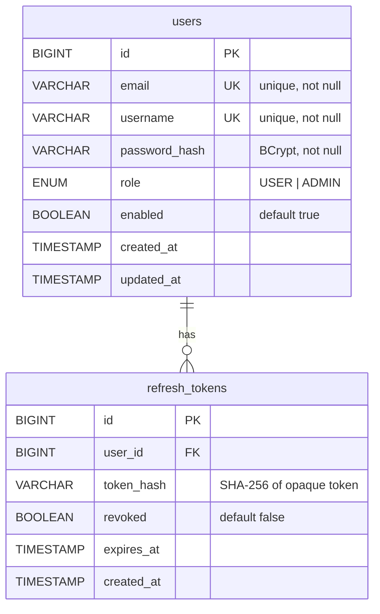
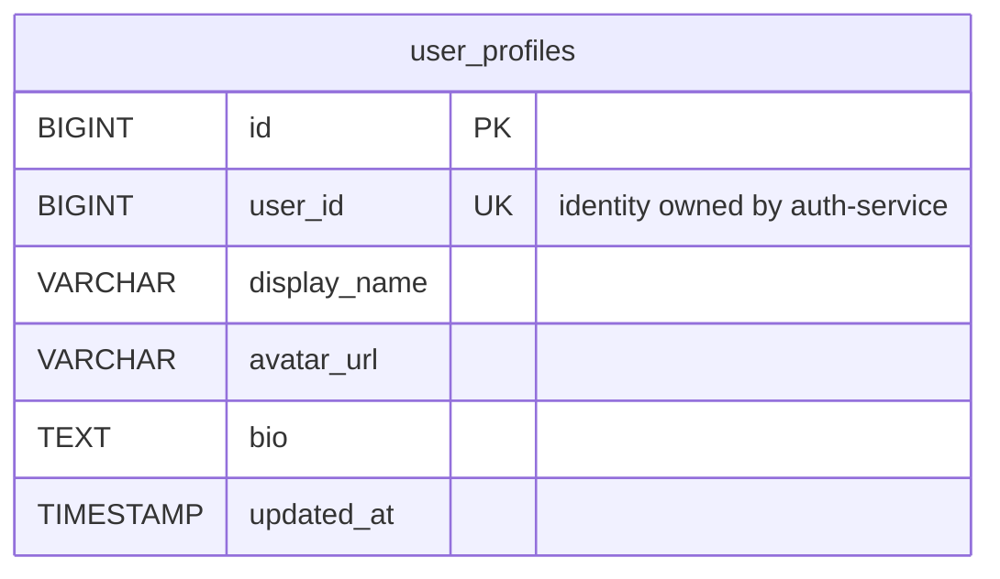
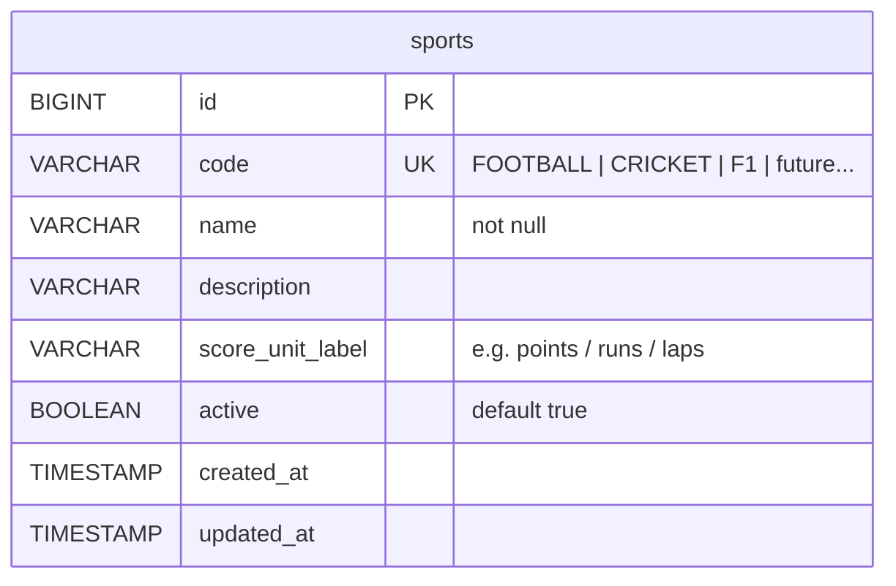
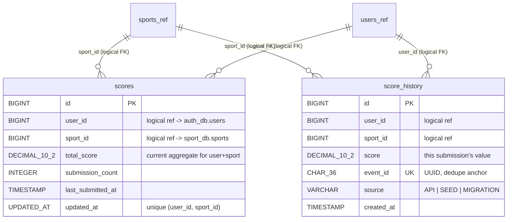

# Database & Redis Schema

**Product:** Real-Time Leaderboard System
**Status:** Phase 0 target schema (migrations land with each service phase)
**Related:** [DESIGN.md §Boundaries](DESIGN.md) · [SECURITY.md](SECURITY.md)

---

## 1. Data Ownership Strategy

Database-per-service. No microservice reads or writes another service's tables — integration happens through APIs (OpenFeign) or events (Kafka). This is what keeps "add a new sport" a pure data change and lets services evolve schemas independently.

| Schema | Owner | Tables |
|---|---|---|
| `auth_db` | auth-service | `users`, `refresh_tokens` |
| `user_db` | user-service | `user_profiles` |
| `sport_db` | sport-service | `sports` |
| `score_db` | score-service | `scores`, `score_history` |
| *(no MySQL)* | leaderboard-service | Redis keyspace only; reports read via score-service API |

Identity duplication rule: services store **only `user_id` + denormalized `username` snapshot where display requires it**; credentials never leave `auth_db`.

## 2. ER Diagrams

### auth_db


### user_db


### sport_db


### score_db


> Cross-schema foreign keys are intentionally **logical references only** (`user_id`, `sport_id`) because the tables live in separate databases owned by separate services. Referential integrity across boundaries is enforced by validation at write time.

## 3. Table Specifications

### 3.1 `auth_db.users`
| Column | Type | Constraints | Notes |
|---|---|---|---|
| id | BIGINT | PK AUTO_INCREMENT | |
| email | VARCHAR(255) | NOT NULL UNIQUE | lowercased on write |
| username | VARCHAR(50) | NOT NULL UNIQUE | `[a-zA-Z0-9_]{3,30}` |
| password_hash | VARCHAR(72) | NOT NULL | BCrypt output only |
| role | ENUM('USER','ADMIN') | NOT NULL DEFAULT 'USER' | mirrored into JWT claim |
| enabled | BOOLEAN | NOT NULL DEFAULT TRUE | soft-disable login |
| created_at / updated_at | TIMESTAMP | NOT NULL | UTC, DB defaults |

Indexes: unique(`email`), unique(`username`).

### 3.2 `auth_db.refresh_tokens`
| Column | Type | Constraints |
|---|---|---|
| id | BIGINT | PK |
| user_id | BIGINT | NOT NULL, INDEX |
| token_hash | CHAR(64) | NOT NULL UNIQUE (SHA-256 hex) |
| revoked | BOOLEAN | NOT NULL DEFAULT FALSE |
| expires_at | TIMESTAMP | NOT NULL |
| created_at | TIMESTAMP | NOT NULL |

Index: `(user_id)`; purge job deletes rows expired > 30 days.

### 3.3 `user_db.user_profiles`
| Column | Type | Constraints |
|---|---|---|
| id | BIGINT | PK |
| user_id | BIGINT | NOT NULL UNIQUE |
| display_name | VARCHAR(50) | |
| avatar_url | VARCHAR(500) | validated URL |
| bio | TEXT | length-capped in DTO |
| updated_at | TIMESTAMP | NOT NULL |

Row lazily created on first profile save; reads fall back to JWT username.

### 3.4 `sport_db.sports`
| Column | Type | Constraints | Notes |
|---|---|---|---|
| id | BIGINT | PK AUTO_INCREMENT | referenced as `sportId` in APIs |
| code | VARCHAR(20) | NOT NULL UNIQUE | drives all derived keys/topics: `leaderboard:{lower(code)}` |
| name | VARCHAR(100) | NOT NULL | |
| description | VARCHAR(500) | | |
| score_unit_label | VARCHAR(30) | | UI display ("points", "runs") |
| active | BOOLEAN | NOT NULL DEFAULT TRUE | disabled ⇒ submissions rejected |
| created_at / updated_at | TIMESTAMP | NOT NULL | |

Seed data (migration, idempotent): `FOOTBALL`, `CRICKET`, `F1`. **No application code may branch on these values.**

### 3.5 `score_db.scores`
Aggregated current state per (user, sport) — mirrors what Redis holds, but durable and queryable.
| Column | Type | Constraints |
|---|---|---|
| id | BIGINT | PK |
| user_id | BIGINT | NOT NULL |
| sport_id | BIGINT | NOT NULL |
| total_score | DECIMAL(12,2) | NOT NULL DEFAULT 0 |
| submission_count | INT | NOT NULL DEFAULT 0 |
| last_submitted_at | TIMESTAMP | |
| updated_at | TIMESTAMP | NOT NULL |

Unique(`user_id`,`sport_id`); index(`sport_id`, `total_score DESC`) supports historical verification queries.

### 3.6 `score_db.score_history`
Append-only. The single source of truth for every point ever awarded; feeds Redis rebuilds and all reports.
| Column | Type | Constraints |
|---|---|---|
| id | BIGINT | PK |
| user_id | BIGINT | NOT NULL |
| sport_id | BIGINT | NOT NULL |
| score | DECIMAL(12,2) | NOT NULL, CHECK (score >= 0 and <= 1000000) via app-level validation |
| event_id | CHAR(36) | NOT NULL UNIQUE — Kafka dedupe + audit join key |
| source | VARCHAR(20) | NOT NULL DEFAULT 'API' |
| created_at | TIMESTAMP | NOT NULL |

Indexes: `(user_id, created_at DESC)` history page; `(sport_id, created_at DESC)` period reports; unique(`event_id`).

## 4. Redis Keyspace

Redis is the **live leaderboard engine**. Member = `userId`; score = aggregate points. All timestamps UTC.

### 4.1 Key patterns

| Pattern | Example | Purpose | TTL |
|---|---|---|---|
| `leaderboard:global` | — | all-time, all sports | none |
| `leaderboard:{code}` | `leaderboard:f1` | all-time per sport (`{code}` = lowercase sport code from `sports` table) | none |
| `leaderboard:global:daily:{yyyy-MM-dd}` | `leaderboard:global:daily:2026-08-25` | day window, all sports | 8 days |
| `leaderboard:{code}:daily:{yyyy-MM-dd}` | `leaderboard:cricket:daily:2026-08-25` | day window per sport | 8 days |
| `leaderboard:{code}:weekly:{yyyy}-W{ww}` | `leaderboard:football:weekly:2026-W35` | ISO week per sport | 40 days |
| `leaderboard:global:weekly:{yyyy}-W{ww}` | — | ISO week, all sports | 40 days |
| `leaderboard:f1:season:{yyyy}` | `leaderboard:f1:season:2026` | F1 season board | 400 days |
| `processed:event:{eventId}` | `processed:event:7c9e...` | consumer idempotency marker (`SET NX EX 48h`) | 48 h |
| `cache:sports:active` | — | JSON cache of enabled catalog | 60 s |

Because `{code}` originates in MySQL, adding `TENNIS` instantly produces `leaderboard:tennis*` usage with zero code change.

### 4.2 Commands and why each is used

| Command | Where used | Why this command |
|---|---|---|
| `ZINCRBY key increment member` | score path, consumer path | Atomic O(log N) aggregation — a submission *adds* points without read-modify-write races. |
| `ZADD key score member` | bootstrap/rebuild from `score_history`; corrections | Sets absolute value when reconstructing state rather than incrementing. |
| `ZREVRANGE key start stop WITHSCORES` | top-N pages, WS snapshots | Highest-first pagination in one O(log N + M) call — the core leaderboard read. |
| `ZRANGE key start stop WITHSCORES` | ascending views, debug/verify | Lowest-first slice (e.g., "bottom of table"), same cost profile. |
| `ZREVRANK key member` | "my rank" endpoint | O(log N) position lookup without scanning. |
| `ZSCORE key member` | "my score" endpoint | O(1)-ish direct member score. |
| `ZCARD key` | rank context ("#N of M players") | O(1) cardinality. |
| `ZRANK key member` | ascending-position needs (rare, e.g., "players behind me") | Symmetric counterpart of ZREVRANK. |

Deliberate non-usage: no `KEYS` (O(N), blocks server) — scans use `SCAN` if ever needed; no leaderboard logic via SQL `ORDER BY`.

### 4.3 Consistency & lifecycle rules

1. Producer-side sync `ZINCRBY` gives read-your-write; consumer re-applies from events using the same idempotency guard so double-apply cannot occur (`processed:event:*` marker checked before increment).
2. Windowed keys are created lazily on first `ZINCRBY`; TTL applied at creation (`EXPIRE`).
3. Rebuild procedure (runbook): stop consumers → for each scope, `DEL` key → stream `score_history` grouped by scope → `ZADD` batches → resume. Documented script ships in Phase 8/13.
4. Clock discipline: window keys derive from **event `occurredAt`**, never consume-time wall clock, avoiding skew artifacts (PRD R-08).

## 5. Kafka Event Schema

Topic: `score-submitted` · Key: `userId` · Format: JSON.

```json
{
  "eventId": "7c9e6679-7425-40de-944b-e07fc1f90ae7",
  "eventVersion": 1,
  "eventType": "SCORE_SUBMITTED",
  "userId": 101,
  "sportId": 3,
  "sportCode": "F1",
  "score": 500,
  "occurredAt": "2026-08-25T10:15:29.512Z",
  "producer": "score-service",
  "correlationId": "b31f...c2"
}
```

Rules:
- `eventId` UUID generated by producer; consumer dedupes on it (Redis marker + DB unique constraint as backstop).
- `eventVersion` enables evolution: additive fields only within v1; breaking changes ship as `.v2` topic with dual-publish transition window.
- `sportCode` is carried for convenience but consumers treat `sportId`/catalog as authoritative truth.
- No PII beyond ids/usernames-adjacent data; never credentials ([RULES.md §Kafka](RULES.md)).

## 6. Retention Summary

| Store | What is kept forever | What expires |
|---|---|---|
| MySQL | users, profiles, sports, scores aggregates, full score_history | revoked refresh tokens purged after 30 d past expiry |
| Redis | all-time boards | daily keys 8 d, weekly 40 d, season 400 d, idempotency markers 48 h |
| Kafka | — (replayable while retained) | local broker default 7 d retention |
